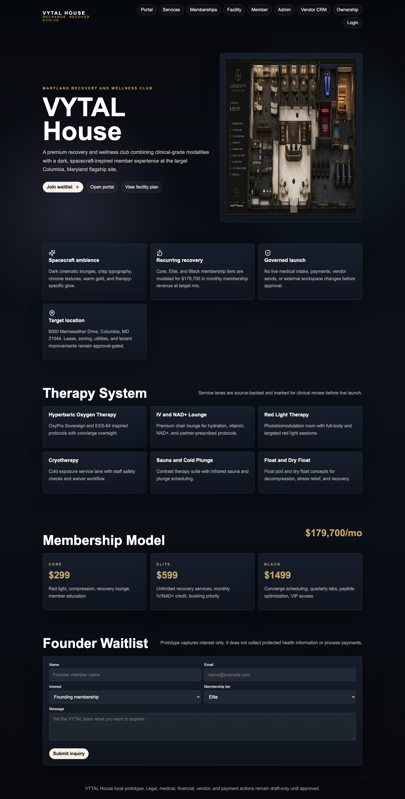
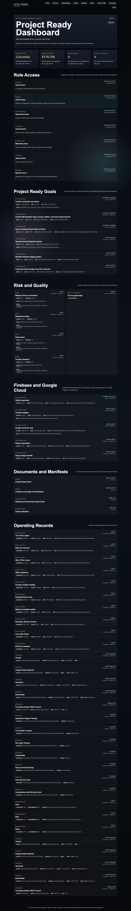
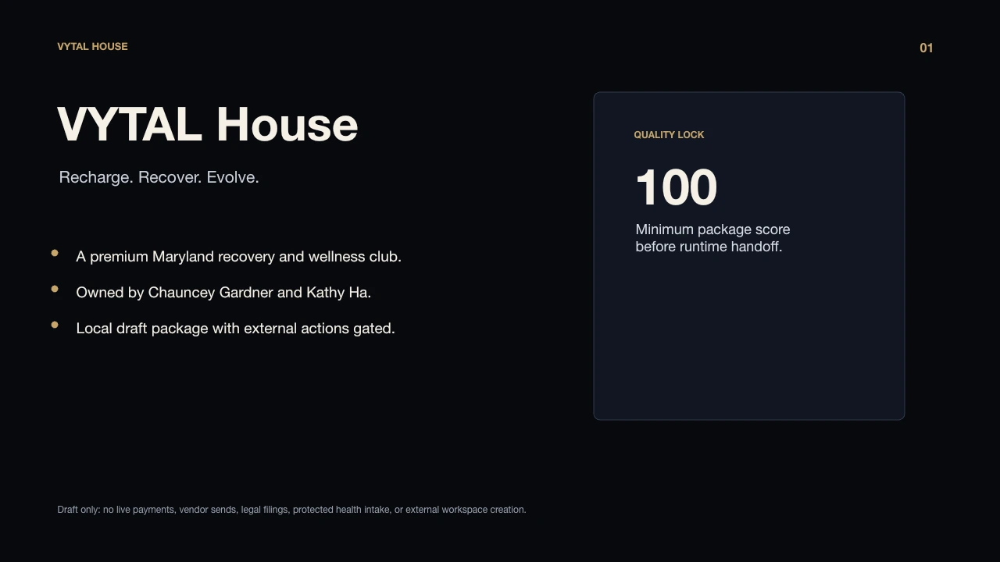
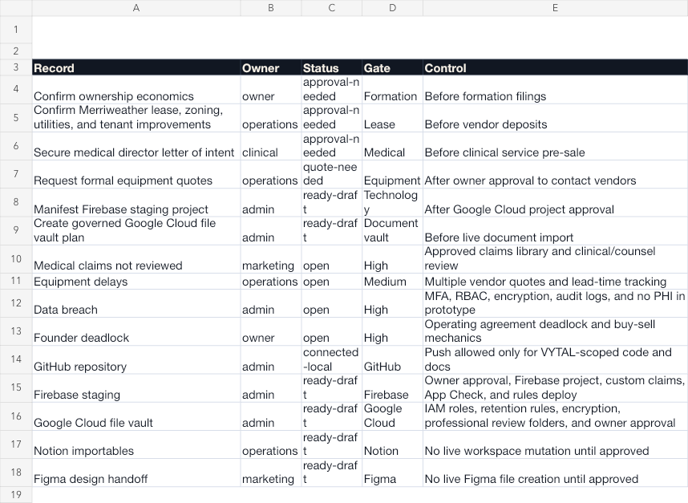

# VYTAL House ✨

**Recharge. Recover. Evolve.**

VYTAL House is a full-stack launch package for a premium recovery and wellness club at **6000 Merriweather Drive, Columbia, MD 21044**. This repository turns the concept into a governed product system: public website, member portal, admin dashboard, local role login, Firebase-ready rules, Google Cloud readiness, business documents, visual artifacts, and quality evidence.



## What This Is 🚀

This repo is the VYTAL House operating blueprint from concept to creation:

1. **Concept** - brand, tagline, target location, service model, memberships, and facility direction.
2. **Design** - `DESIGN.md`, Figma tokens, screenshots, deck previews, and spacecraft-lounge visual rules.
3. **Data** - governed 7-field seed records for services, vendors, memberships, risks, integrations, locations, goals, and portal users.
4. **Portal** - Next.js public site, member surface, admin dashboard, vendor CRM, document viewer, and role-gated command portal.
5. **Cloud Readiness** - Firebase rules/config, Google Cloud file-vault manifest, and environment placeholders.
6. **Artifacts** - DOCX business documents, PPTX deck, XLSX workbook, Notion importables, CSVs, and verification outputs.
7. **Quality Gate** - typecheck, production build, visual QA, DOCX render QA, and repository manifest.

## Live Screens 🖥️







## Quick Start ⚡

```bash
npm install
npm run typecheck
npm run build
npm run dev
```

The app uses local governed seed data by default. Firebase credentials are optional and must be supplied through environment variables before any live data connection is enabled.

## App Surfaces 🧭

| Route | Purpose |
|---|---|
| `/` | Public VYTAL House website and founder waitlist |
| `/login` | Local prototype role login |
| `/portal` | Project-ready command dashboard |
| `/admin` | Launch readiness, quality, risks, and integrations |
| `/member` | Member dashboard prototype |
| `/vendor` | Vendor CRM prototype |
| `/ownership` | Ownership and formation dashboard |
| `/docs/project-ready-goals` | Rendered local project-goals manifest |
| `/docs/firebase-google-cloud-manifest` | Firebase and Google Cloud readiness |
| `/docs/concept-to-creation-manifest` | Concept-to-creation path |

## Demo Portal Codes 🔐

These are local prototype review codes only. Production must use Firebase Auth, MFA, custom role claims, App Check, and audit logging.

| Role | Code |
|---|---|
| Owner | `VYTAL-OWNER` |
| Admin | `VYTAL-ADMIN` |
| Operations | `VYTAL-OPS` |
| Clinical | `VYTAL-CLINICAL` |
| Marketing | `VYTAL-MARKETING` |
| Vendor | `VYTAL-VENDOR` |
| Member | `VYTAL-MEMBER` |

## Package Map 📦

| Path | What It Contains |
|---|---|
| `DESIGN.md` | Agent-readable VYTAL visual identity spec |
| `docs/` | Numbered BRD, manifest, governance, cloud, launch, and handoff docs |
| `src/app/` | Next.js App Router website, portal, dashboards, API routes, and doc viewer |
| `src/components/` | Navigation, lead form, login panel, record tables, and portal dashboard |
| `src/lib/` | Brand data, governance rules, Firebase bootstrap, and session helpers |
| `data/seeds/` | 7-field records with domain details under `metadata` |
| `firebase/` | Firestore rules, Storage rules, indexes, and Firebase config |
| `importables/` | Notion-ready Markdown/CSV and Figma-ready tokens |
| `deliverables/` | DOCX, PPTX, XLSX, CSV, TXT, screenshot, and preview artifacts |
| `quality/` | Visual checks, quality gate, GitHub handoff, and render evidence |
| `tools/` | Reproducible artifact, visual, and quality scripts |

## Governance Lock 🛡️

Every database-like object must use the 7-field schema:

```ts
id, entity, type, name, status, owner, updatedAt
```

Domain-specific fields live under `metadata`. External actions remain blocked unless explicitly approved:

- no protected health intake
- no payment activation
- no vendor message sending
- no legal filing
- no live Firebase or Google Cloud resource creation
- no live Notion or Figma workspace mutation

## Quality Commands ✅

```bash
npm run typecheck
npm run build
npm run visual
npm run quality
```

Validated in this repo:

- TypeScript check passes.
- Next.js production build passes.
- Playwright visual check passes for desktop, mobile, lead form, and portal login.
- DOCX deliverables render cleanly to inspected page images.
- VYTAL-only brand isolation is enforced by `tools/verify_quality.py`.

## Key Manifests 🗂️

- [Project Ready Goals](docs/21_PROJECT_READY_GOALS.md)
- [Firebase and Google Cloud Manifest](docs/22_FIREBASE_GOOGLE_CLOUD_MANIFEST.md)
- [Desktop and Downloads Import Audit](docs/23_DESKTOP_DOWNLOADS_IMPORT_AUDIT.md)
- [Concept to Creation Manifest](docs/24_CONCEPT_TO_CREATION_MANIFEST.md)
- [Delivery Manifest](docs/14_DELIVERY_MANIFEST.md)
- [GitHub Handoff](docs/15_GITHUB_HANDOFF.md)

## Professional Review Notice ⚖️

Legal, medical, financial, tax, lease, insurance, clinical, payment, and securities materials are drafts for licensed professional review. This repository is a controlled planning and prototype system, not a filing, clinical protocol approval, payment activation, or vendor commitment.
