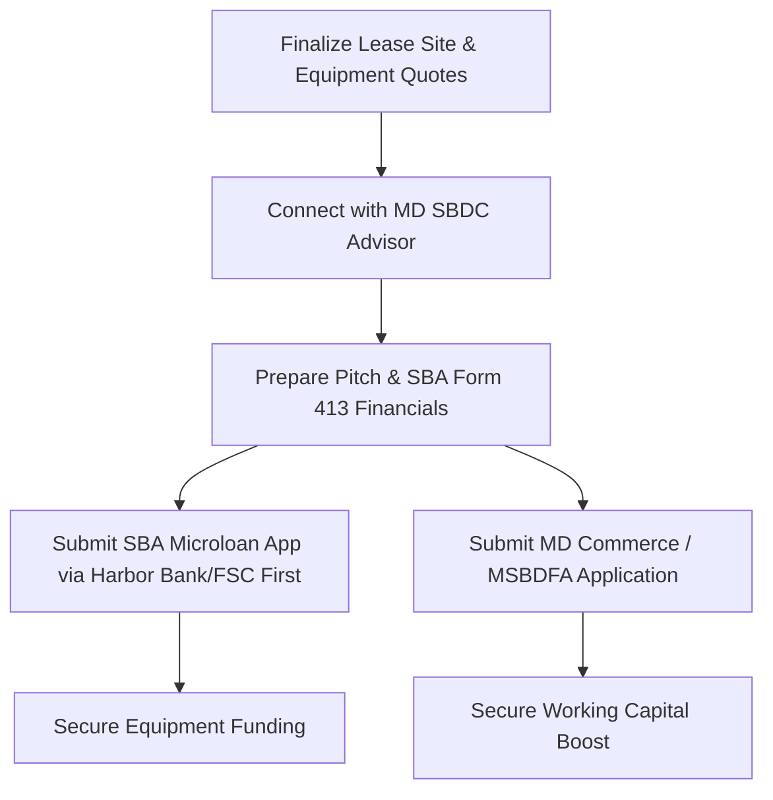

# 18 - Federal & Local SBA Micro-grants and Business Programs

## Executive Summary
VYTAL House LLC will leverage federal, state, and local Maryland business programs, small business grants, microloans, and advisory services to supplement its primary SBA 7(a) financing. These programs provide low-interest capital, technical mentoring, and non-dilutive grant funds.

- **Primary Targets:** Maryland Department of Commerce programs, local county economic development funds, and SBA-partnered microloan intermediaries.
- **Goal:** Secure up to $50,000 in microloans for localized equipment (e.g., red light beds or cold plunges) and obtain SBDC technical mentorship.
- **Filing Status:** Planning draft for advisory board review.

---

## 1. Federal SBA Microloan Program
The SBA Microloan program provides loans up to $50,000 to help small businesses start and expand.
- **Intermediaries in Maryland:** FSC First (Prince George's County/Statewide) and Harbor Bank of Maryland (Baltimore/Statewide).
- **Terms:** Average microloan is about $13,000, with maximum interest rates capped by the SBA. Repayment terms are up to 6 years.
- **Use of Proceeds:** Purchase of specific, individual clinical modalities (e.g., Cryotherapy chamber delivery, Red Light bed installation, or local office furniture).
- **Requirements:** Personal guarantees from Kathy Ha and Chauncey Gardner, plus business asset collateral.

---

## 2. Maryland State Programs

### Maryland Small Business Development Financing Authority (MSBDFA)
MSBDFA provides financing to socially and economically disadvantaged businesses in Maryland.
- **Programs:** Contract Financing, Equity Participation, and Working Capital Loans.
- **Eligibility:** Business must be owned/controlled by socially or economically disadvantaged individuals (perfectly aligning with Kathy Ha's SBA 8(a) profile).
- **Application Path:** Apply through the Maryland Department of Commerce.

### Maryland Economic Development Assistance Authority and Fund (MEDAAF)
MEDAAF provides grants, loans, and investments directly to support economic development projects in priority funding areas.
- **Target:** Assistance with leasehold improvements for the wellness facility in designated Maryland revitalization or growth zones.

---

## 3. Local and County Grants
Depending on the final site selection in Maryland:

### Montgomery County Economic Development
- **Small Business Assistance Program:** Direct grants for small businesses undergoing local construction or leasehold improvements.
- **Green Business Certification & Grants:** Future opportunities to secure local grants by implementing energy-efficient sauna and water filtration systems.

### Baltimore County Department of Economic Development
- **Boost Fund:** Small business lending programs providing matching funds for local equipment purchase and leasehold renovations.

---

## 4. Advisory and Technical Mentorship
Before applying, VYTAL House will utilize free advisory programs to audit the application packages:
- **Maryland Small Business Development Center (SBDC):** Provides free, confidential business counseling, financial modeling audits, and lender matchmaking.
- **SCORE Maryland:** Connects founders with retired executives for mentorship on clinical-spa operations and lease negotiations.

---

## Application Action Steps
To apply for these programs, the operations and marketing owners will proceed as follows:

1. **Intake Audit:** Schedule an initial review with the Maryland SBDC to refine the VYTAL business plan (Document 02) and pro forma workbook.
2. **Microloan Submission:** Prepare Form 413 and submit the microloan application to FSC First or Harbor Bank of Maryland to secure $50,000 specifically earmarked for the Cryotherapy or Red Light Therapy equipment.
3. **County Pitch:** Contact the local County Economic Development office once a lease LOI is signed to request matching grant funds for tenant improvements.

---

## Disclaimer
All grants, microloans, and county assistance programs are subject to budget allocations, credit approval, and changing regional guidelines. VYTAL House will work with its legal counsel and certified public accountant (CPA) to review all grant terms, tax liabilities, and debt covenants prior to execution.
